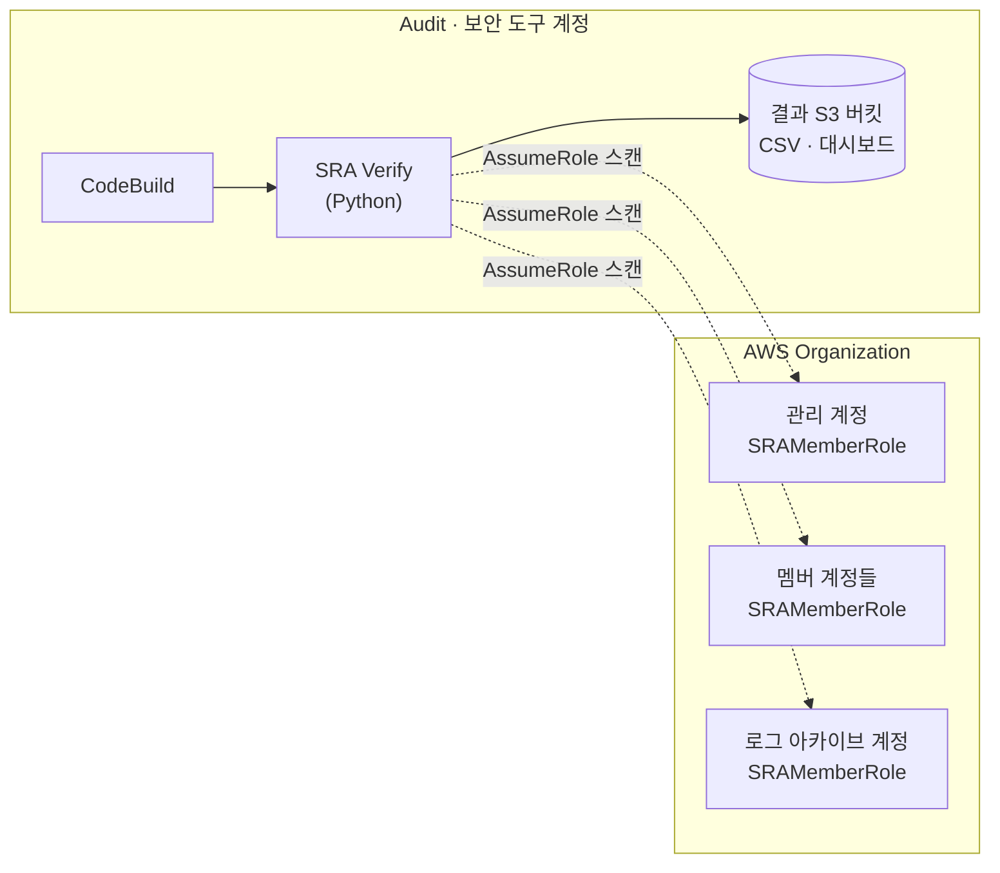

# AWS SRA 진단 — SRA Verify

> **한 줄 요약** — [AWS Security Reference Architecture(SRA)](https://docs.aws.amazon.com/prescriptive-guidance/latest/security-reference-architecture/welcome.html) 기준으로 **조직(Organization) 전 계정·리전의 보안 서비스 구성**을 자동 점검하고, 발견사항과 조치 가이드를 산출하는 오픈소스 진단 도구입니다.

:::info 개요
"우리 AWS 계정 구성이 AWS 보안 모범사례(SRA)에 얼마나 부합하나?" 를 자동으로 평가합니다.
CloudTrail·GuardDuty·IAM Access Analyzer·AWS Config·Security Hub·S3 등 핵심 보안 서비스의 구성을 계정 유형(관리/감사/로그 아카이브)별로 점검하고, CSV·대시보드·생성형 AI 요약으로 결과를 제공합니다.
오픈소스: [`awslabs/sra-verify`](https://github.com/awslabs/sra-verify)
:::

:::warning 범위 주의
SRA Verify는 여러 서비스에 대한 체크를 포함하지만 SRA의 *모든* 고려사항을 다루지는 않습니다.
진단 결과는 출발점으로 삼고, [AWS SRA Prescriptive Guidance](https://docs.aws.amazon.com/prescriptive-guidance/latest/security-reference-architecture/welcome.html) 원문과 함께 해석하세요.
:::

## 관련 보안 영역 (Alignment)

이 진단은 다음 지식베이스 영역의 구현 상태를 **실제 계정 기준으로 검증**합니다.

- [Part 1 · 보안 기초 → Well-Architected 보안 기둥](../foundations/well-architected-security-pillar.md) — SRA/모범사례의 근거
- [Part 2 · 자격증명 & 접근 관리 → 멀티 계정 / Organizations](../identity-access/multi-account-organizations.md) — 감사·로그 아카이브 계정 구조
- [Part 6 · 탐지 & 대응 → 위협 탐지(GuardDuty)](../detection-response/detection/threat-detection-guardduty.md) · [로깅 & 감사](../detection-response/detection/logging-auditing.md)
- [Part 8 · 거버넌스 & 컴플라이언스 → Landing Zone / Control Tower](../governance-compliance/landing-zone-control-tower.md) — SRA 정렬의 토대

## 점검 대상 (Checks)

| 영역 | 점검 예시 |
| --- | --- |
| **CloudTrail** | 조직 트레일, 다중 리전, 로그 무결성 검증 |
| **GuardDuty** | 조직 차원 활성화, 위임 관리자 구성 |
| **IAM Access Analyzer** | 조직/계정 분석기 활성화 |
| **AWS Config** | 레코더·전송 채널 구성, 조직 집계 |
| **Security Hub** | 표준 활성화, 위임 관리자, 결과 집계 |
| **S3** | 퍼블릭 액세스 차단, 기본 암호화 |

> 계정 유형(**management / audit(security tooling) / log archive**)별로 적용되는 체크가 다릅니다.

## 아키텍처



## 사전 요구사항 (Prerequisites)

- [ ] AWS Organizations 사용, 스캔을 실행할 **Audit(보안 도구) 계정** 결정
- [ ] CloudFormation StackSets 권한 (관리 계정 또는 위임 관리자)
- [ ] 스캔 대상 리전 목록

## 배포 (Deployment)

### 1단계 — 멤버 역할 배포 (전 계정)

각 계정에 `SRAMemberRole` 을 StackSets로 배포해, Audit 계정이 스캔용으로 AssumeRole 할 수 있게 합니다.

```bash
# 관리 계정 또는 위임 관리자의 CloudShell에서
wget https://raw.githubusercontent.com/awslabs/sra-verify/refs/heads/main/1-sraverify-member-roles.yaml

aws cloudformation create-stack-set --template-body file://1-sraverify-member-roles.yaml \
  --stack-set-name sraverify-member-roles \
  --permission-model SERVICE_MANAGED \
  --auto-deployment Enabled=true,RetainStacksOnAccountRemoval=false \
  --capabilities CAPABILITY_NAMED_IAM \
  --parameters ParameterKey=SRAVerifyAccountID,ParameterValue=<scan-account-id> \
  --region <region> --call-as <SELF|DELEGATED_ADMIN>

# 루트 OU(또는 특정 OU) 전체에 스택 인스턴스 생성
aws cloudformation create-stack-instances --stack-set-name sraverify-member-roles \
  --deployment-targets OrganizationalUnitIds='["<root-ou>"]' \
  --regions '["<region>"]' \
  --operation-preferences FailureTolerancePercentage=100,MaxConcurrentPercentage=100 \
  --region <region> --call-as <SELF|DELEGATED_ADMIN>
```

> StackSets는 관리 계정에는 배포되지 않으므로, 관리 계정에는 동일 템플릿을 `aws cloudformation deploy` 로 별도 배포합니다.

### 2단계 — SRA Verify 실행 (CodeBuild)

Audit 계정에서 CodeBuild 작업을 만드는 템플릿을 배포하면, 배포 직후 스캔이 자동 시작됩니다.

```bash
# Audit 계정의 CloudShell에서
wget https://raw.githubusercontent.com/awslabs/sra-verify/refs/heads/main/2-sraverify-codebuild-deploy.yaml

aws cloudformation deploy \
  --template-file 2-sraverify-codebuild-deploy.yaml \
  --stack-name sra \
  --parameter-overrides \
    AuditAccountID=<audit-account-id> \
    LogArchiveAccountID=<log-account-id> \
    IncludeRegions=us-east-1,us-west-2,ap-northeast-2 \
  --capabilities CAPABILITY_IAM CAPABILITY_NAMED_IAM
```

### 로컬 실행 (선택)

특정 체크/계정 유형만 빠르게 돌릴 때 유용합니다(계정별 자격증명은 직접 관리).

```bash
git clone https://github.com/awslabs/sra-verify.git
python -m venv .venv && source .venv/bin/activate
pip install -r sraverify/requirements.txt
# 또는: pip install sraverify
```

## 결과 확인 (Results)

스캔이 끝나면 결과가 S3 버킷(`...bucketsraverifyfindings`)의 `sraverify/reports/` 에 업로드됩니다.

- **CSV**: `reports/consolidated/` (통합) 또는 `reports/raw/` (원본) — 발견사항·조치 가이드 포함
- **대시보드**: `consolidated/sra-verify-dashboard.html` — 요약 시각화 (CSV는 presigned URL로 1분 공유 후 로드)
- **생성형 AI 요약**: 대시보드의 *Copy generative AI prompt* → Amazon Bedrock 등에 붙여 요약

:::danger presigned URL 주의
presigned URL은 생성자 권한으로 시간제한 다운로드를 허용합니다. 조직 보안 정책에 따라 공유 범위·만료(예: 1분)를 최소화하세요. 생성형 AI 요약 시 결과에 조직 정보가 포함되므로 사내 정책을 먼저 확인하세요.
:::

## 활용 흐름 (운영)

1. **초기 진단** — 전 계정 스캔으로 SRA 정렬 베이스라인 확보
2. **갭 우선순위화** — 발견사항을 [위협 모델링](../foundations/threat-modeling-attack.md)·중요도로 정렬
3. **조치** — 관련 Part의 설계 가이드로 통제 구현 (예: GuardDuty 미활성 → Part 6)
4. **정기 재진단** — 변경/드리프트 탐지, [지속적 모니터링](../detection-response/detection/continuous-monitoring.md)과 연계

## 자주 묻는 질문 (FAQ)

**Q. 어떤 계정에서 실행하나요?**
A. 일반적으로 Audit(보안 도구) 계정에서 실행하며, 각 멤버 계정에는 스캔용 역할(`SRAMemberRole`)만 배포합니다.

**Q. 에이전트나 상시 인프라가 필요한가요?**
A. 아니요. CodeBuild 작업으로 일회성(또는 주기) 실행하며, 결과만 S3에 남깁니다.

**Q. AI 에이전트와 연동되나요?**
A. MCP 서버 [`awslabs/sra-verify-mcp`](https://github.com/awslabs/sra-verify-mcp) 로 생성형 AI 에이전트에서 점검을 실행/해석할 수 있습니다.

## 리소스 정리 (Cleanup)

```bash
# Audit 계정: CodeBuild 스택 삭제
aws cloudformation delete-stack --stack-name sra
# 관리/위임 관리자: 멤버 역할 StackSet 인스턴스·StackSet 삭제
```

## 고객 배포 체크리스트

- [ ] 스캔 실행 계정(Audit) 및 로그 아카이브 계정 ID 확인
- [ ] 멤버 역할 StackSet이 전 계정(관리 계정 포함)에 배포됐는지 확인
- [ ] 스캔 대상 리전(IncludeRegions) 지정 (예: `ap-northeast-2` 포함)
- [ ] CodeBuild 실행 완료 및 S3 결과 업로드 확인
- [ ] 대시보드로 요약 검토 → 발견사항 백로그화
- [ ] 정기 재진단 주기 결정

## 참고자료

- [SRA Verify (GitHub)](https://github.com/awslabs/sra-verify) · [MCP 서버](https://github.com/awslabs/sra-verify-mcp) · [PyPI `sraverify`](https://pypi.org/project/sraverify/)
- [Introducing SRA Verify (AWS Security Blog)](https://aws.amazon.com/blogs/security/introducing-sra-verify-an-aws-security-reference-architecture-assessment-tool/)
- [AWS Security Reference Architecture (Prescriptive Guidance)](https://docs.aws.amazon.com/prescriptive-guidance/latest/security-reference-architecture/welcome.html)
- [SRA 예제 구현 (aws-samples)](https://github.com/aws-samples/aws-security-reference-architecture-examples)
