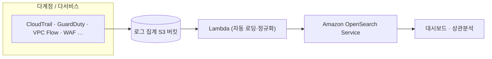

# SIEM on Amazon OpenSearch Service

> **한 줄 요약** — 여러 계정의 AWS 로그를 한 곳에 모아 **상관분석·시각화**하여 보안 인시던트를 조사할 수 있는 오픈소스 SIEM을 CloudFormation/CDK로 약 30분에 배포합니다.

:::info 개요
지정한 S3 버킷에 AWS 서비스 로그가 적재되면 전용 Lambda가 자동으로 [Amazon OpenSearch Service](https://docs.aws.amazon.com/opensearch-service/)에 로딩하고, 대시보드에서 여러 로그를 상관분석할 수 있습니다. 오픈소스: [`aws-samples/siem-on-amazon-opensearch-service`](https://github.com/aws-samples/siem-on-amazon-opensearch-service)
:::

## 관련 보안 영역 (Alignment)

- [Part 6 · SIEM / Security Lake](../detection-response/detection/siem-security-lake.md) — 로그 정규화·상관분석
- [Part 6 · 로깅 & 감사](../detection-response/detection/logging-auditing.md) · [지속적 모니터링](../detection-response/detection/continuous-monitoring.md)
- WAF [SEC 4 · 탐지](../foundations/well-architected-alignment.md#detection)
- 진단 결과의 후속 조사 도구로 [SRA Verify](./sra-verify.md)와 연계

## 지원 로그 (일부)
| 분류 | 예 |
| --- | --- |
| 보안 | GuardDuty · Security Hub · Inspector · WAF · Network Firewall · CloudHSM |
| 관리/거버넌스 | CloudTrail(+Insight) · Config · Trusted Advisor |
| 네트워크 | VPC Flow Logs · Route 53 Resolver(DNS) · CloudFront · Transit Gateway |

> 100여 종 로그 타입을 정규화·상관분석합니다. 전체 목록은 저장소의 *Supported Log Types* 참조.

## 아키텍처



## 사전 요구사항
- [ ] 로그가 집계되는 **S3 버킷**(Control Tower/Security Lake 연동 시 자동화)
- [ ] OpenSearch Service(또는 **OpenSearch Serverless**) 배포 권한
- [ ] CloudFormation 또는 CDK 실행 환경

## 배포
```bash
# CloudFormation 또는 CDK로 배포 (약 30분)
# 템플릿/CDK 앱은 저장소의 Advanced Deployment 가이드 참조
```
> 📦 **배포 에셋**: [SIEM on OpenSearch (GitHub)](https://github.com/aws-samples/siem-on-amazon-opensearch-service) — CloudFormation/CDK + 대시보드.

## 통합
- **AWS Control Tower**: 다계정 로그를 표준 경로로 수집.
- **Amazon Security Lake**: OCSF 정규화 로그를 소스로 연계.

## 핵심 고려사항
- Security Lake/Security Hub와 **역할 분담**: 수집·정규화는 Security Lake, 시각화·상관분석·조사는 SIEM on OpenSearch로 보완.
- OpenSearch Serverless로 운영 부담을 줄일 수 있으나 비용 모델이 다르므로 데이터량 기준으로 비교.
- 로그 보존기간·인덱스 수명주기(ISM)로 비용을 관리.

## 참고자료
- [SIEM on Amazon OpenSearch Service (GitHub)](https://github.com/aws-samples/siem-on-amazon-opensearch-service)
- [Amazon OpenSearch Service](https://docs.aws.amazon.com/opensearch-service/) · [Amazon Security Lake](https://docs.aws.amazon.com/security-lake/)
